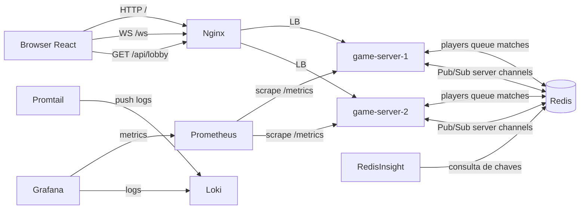

# Jogo da Forca Distribuido (Sistemas Distribuidos)

Projeto distribuido com:

- Backend: `FastAPI + WebSocket`
- Frontend: `React` (pasta `frontend`)
- Estado compartilhado: `Redis`
- Interface grafica do Redis: `RedisInsight`
- Balanceamento: `Nginx`
- Redundancia: `game-server-1` e `game-server-2`
- Observabilidade: `Prometheus + Grafana + Loki + Promtail`
- Orquestracao: `Docker Compose`

## 1. Arquitetura

Documentação detalhada de revisão dos requisitos do trabalho: `docs/backend-revisao-requisitos.md`.
- Documentação técnica completa do backend por funcionalidade: `docs/backend-funcionalidades-detalhadas.md`.
- Guia de teste manual de reconexão/failover: `docs/teste-reconexao-failover.md`.

### Visao geral

- O frontend abre em `http://localhost`.
- WebSocket de jogo passa por `nginx` em `/ws`.
- HTTP de lobby passa por `nginx` em `/api/lobby`.
- Os 2 backends leem e escrevem estado no Redis.
- Eventos para clientes conectados em outro backend sao enviados por `Redis Pub/Sub`.
- Logs dos containers vao para Loki via Promtail e ficam consultaveis no Grafana.
- RedisInsight permite inspecionar chaves/fila/partidas em tempo real.

### Diagrama (Mermaid)



## 2. Regra atual da forca (turnos + 3 rodadas)

Cada partida tem 2 jogadores com palavra compartilhada por rodada e **forca individual por jogador**:

1. A partida possui 3 rodadas, cada uma com palavra aleatoria e tema.
2. O jogo e por turnos (um jogador por vez).
3. Cada rodada usa a mesma palavra para ambos, com letras certas compartilhadas e erros individuais.
4. O jogador pode jogar letra ou chutar a palavra inteira.
5. Se errar o chute de palavra inteira, perde a partida automaticamente (`reason=wrong_word_guess`).
6. Se um jogador atingir 6 erros na rodada, perde a rodada automaticamente.
7. Vence quem fizer mais pontos ao final (ou quem fechar maioria antes).

Reconexao e abandono:

- Reconexao em ate 30 segundos.
- Se nao reconectar, adversario vence por abandono (`reason=abandonment`).

## 3. Lobby

Fluxo implementado:

1. Usuario informa o nome.
2. Usuario entra na tela de lobbys.
3. Existem 9 salas pre-criadas por padrao (`Sala 1` ate `Sala 9`).
4. Usuario pode entrar em uma sala existente.
5. Usuario tambem pode criar uma sala nova.
6. Ao entrar 2 jogadores na mesma sala, a partida inicia.

Endpoint:

- `GET /api/lobby` (proxied para `/lobby` no backend).
- `POST /api/lobby/rooms` para criar nova sala.

## 4. Estrutura de pastas

```text
.
├── backend
│   ├── app
│   │   ├── core
│   │   ├── data
│   │   ├── models
│   │   ├── monitoring
│   │   ├── repositories
│   │   ├── services
│   │   ├── websocket
│   │   └── main.py
│   ├── Dockerfile
│   └── requirements.txt
├── frontend
│   ├── src
│   ├── Dockerfile
│   └── package.json
├── infra
│   ├── nginx/nginx.conf
│   ├── prometheus/prometheus.yml
│   ├── loki/loki-config.yml
│   ├── promtail/promtail-config.yml
│   └── grafana
│       ├── dashboards
│       └── provisioning
├── docs
│   └── architecture.mmd
├── docker-compose.yml
└── README.md
```

## 5. Protocolo WebSocket

### Cliente -> Servidor

- `register_player` (ou `join_queue` para compatibilidade)
- `join_room`
- `guess_letter`
- `guess_word`
- `reconnect`
- `heartbeat`

### Servidor -> Cliente

- `connected`
- `room_joined`
- `queue_update`
- `match_found`
- `game_state`
- `opponent_disconnected`
- `reconnected`
- `heartbeat_ack`
- `game_over`
- `error`

Campos principais do novo `game_state`:

- `round_number`
- `total_rounds`
- `theme`
- `masked_word`
- `correct_letters`
- `wrong_letters`
- `opponent_wrong_letters`
- `errors`
- `opponent_errors`
- `remaining_errors`
- `opponent_remaining_errors`
- `turn`
- `is_your_turn`
- `your_score`
- `opponent_score`
- `can_guess`
- `round_history`

## 6. Como rodar

### Pre-requisitos

- Docker + Docker Compose com daemon ativo.

### Configuracao do frontend (novo)

- O `docker-compose.yml` usa `frontend` como contexto de build do frontend.
- Em modo local (fora do Docker), execute em `frontend/`:
  - `npm install`
  - `npm run dev`
- Opcional: configurar `VITE_WS_URL` para apontar para um endpoint WebSocket especifico.
- O frontend usa `sessionStorage` (escopo por aba) para isolar sessão de jogador entre abas do mesmo navegador.

### Subir tudo

```bash
docker compose down -v
docker compose up --build
```

Se o frontend parecer "antigo" (cache de build/imagem), rode:

```bash
docker compose down
docker compose build --no-cache frontend
docker compose up -d
```

E no navegador faça um hard refresh (`Ctrl+F5`) ou abra em aba anônima para validar o novo bundle.

Se ainda aparecer tema escuro indevido, limpe cache do navegador/site data para `http://localhost` e recarregue.

### Abrir todas as URLs automaticamente (Windows / PowerShell)

Abrir tudo de uma vez:

```powershell
powershell -ExecutionPolicy Bypass -File .\scripts\open-urls.ps1
```

Abrir e aguardar os servicos responderem antes:

```powershell
powershell -ExecutionPolicy Bypass -File .\scripts\open-urls.ps1 -Wait
```

Subir ambiente + abrir URLs em um comando:

```powershell
powershell -ExecutionPolicy Bypass -File .\scripts\demo-up.ps1
```

### Acessos

- App: `http://localhost`
- Prometheus: `http://localhost:9090`
- Grafana: `http://localhost:3000` (admin / admin)
- Loki API: `http://localhost:3100`
- RedisInsight: `http://localhost:5540`
- Backend 1 direto: `http://localhost:8001/health`
- Backend 2 direto: `http://localhost:8002/health`

### Conectar o Redis no RedisInsight

1. Abrir `http://localhost:5540`.
2. Criar nova conexao (`Add Redis Database`).
3. Usar:
   - Host: `redis`
   - Port: `6379`
   - Database Alias: `hangman-redis`
4. Salvar e conectar para acompanhar as chaves:
   - `queue:waiting_players`
   - `match:*`
   - `player:*`
   - `reconnect:deadlines`

## 7. Monitoramento e logs

Metricas Prometheus ja existentes:

- `hangman_ws_active_connections`
- `hangman_waiting_players`
- `hangman_active_matches`
- `hangman_matches_finished_total`
- `hangman_queue_wait_seconds`
- `hangman_reconnections_total`
- `hangman_disconnections_total`
- `hangman_errors_total`
- `hangman_backend_up`

Logs no Grafana:

- Datasource `Loki` provisionado automaticamente.
- Dashboard de logs: `Distributed Hangman Logs`.
- Query padrao: logs de `game-server-1`, `game-server-2` e `nginx`.

## 7.1 Como testar reconexão automática e failover (passo a passo)

Este roteiro valida exatamente o cenário:
- jogador A em uma instância,
- jogador B em outra instância,
- queda de uma instância e reconexão automática para a outra.

### 7.1.1 Subir ambiente

```bash
docker compose down -v
docker compose up --build -d
```

### 7.1.2 URLs que você vai usar

- App (frontend + websocket via Nginx): `http://localhost`
- Health backend 1 (direto): `http://localhost:8001/health`
- Health backend 2 (direto): `http://localhost:8002/health`
- Health balanceado pelo Nginx: `http://localhost/health/backend`

### 7.1.3 Preparar duas sessões isoladas

Use dois navegadores diferentes **ou** duas janelas anônimas separadas:
1. Abra `http://localhost` na Janela A.
2. Abra `http://localhost` na Janela B.
3. Entre com nicknames diferentes (ex.: `Alice` e `Bruno`).
4. Façam ambos entrar na mesma sala.
5. Confirme início da partida (`match_found` + `game_state`).

### 7.1.4 Forçar queda de um backend

Em outro terminal, derrube um servidor:

```bash
docker compose stop game-server-2
```

Verifique:
- `http://localhost:8002/health` deve falhar.
- `http://localhost:8001/health` deve continuar ok.
- `http://localhost/health/backend` deve continuar respondendo.

### 7.1.5 O que deve acontecer no cliente

1. O jogador que estava conectado no servidor derrubado perde o socket por alguns instantes.
2. A UI entra em estado de reconexão ("Tentando reconectar...").
3. O frontend tenta automaticamente reconectar em `/ws`.
4. O Nginx direciona a nova conexão para o backend saudável.
5. O cliente recebe `reconnected` e a partida continua (se dentro de 30s).

### 7.1.6 Validar limite de 30 segundos

Para validar abandono:
1. Derrube novamente o backend onde um jogador estava conectado.
2. Não reabra o cliente desse jogador por mais de 30s.
3. O adversário deve receber vitória por `abandonment`.

### 7.1.7 Subir o backend novamente

```bash
docker compose start game-server-2
```

Depois confira:
- `http://localhost:8002/health` voltou.

### 7.1.8 Dica de verificação adicional (logs)

```bash
docker compose logs -f nginx game-server-1 game-server-2
```

Procure eventos de reconexão e mudanças de rota após a queda de uma instância.

Observacao:

- Em ambientes Docker Desktop, se o `promtail` nao conseguir montar `/var/lib/docker/containers`, ajuste esse volume para o caminho equivalente do seu host.

O backend agora emite logs estruturados em JSON para eventos como:

- `player_connected`
- `player_joined_queue`
- `match_created`
- `guess_processed`
- `match_finished`
- `player_disconnected`
- `player_reconnected`

## 8. Roteiro de demonstracao

### A) Lobby

1. Abra `http://localhost`.
2. Veja contadores de partidas em andamento e salas aguardando.
3. Abra novas abas e observe o lobby atualizar.

### B) Duas partidas simultaneas

1. Abra 4 abas.
2. Entre com 4 nicknames.
3. Veja 2 partidas ativas ao mesmo tempo.

### C) Nova regra por turnos

1. Entre em uma partida com 2 jogadores.
2. Valide que so um jogador por vez pode jogar letra.
3. Veja a rodada atual e o tema da palavra no painel.
4. Teste o chute de palavra: se errar, derrota automatica.
5. Jogue ate completar 3 rodadas e confira o placar final.

### D) Reconexao e abandono

1. Feche uma aba durante partida.
2. Reconecte em ate 30s para restaurar.
3. Se nao reconectar em 30s, adversario vence por abandono.

### E) Falha de backend

1. Com partida em andamento:
   ```bash
   docker compose stop game-server-1
   ```
2. O sistema continua pelo `game-server-2`.
3. Estado da partida segue consistente via Redis.
